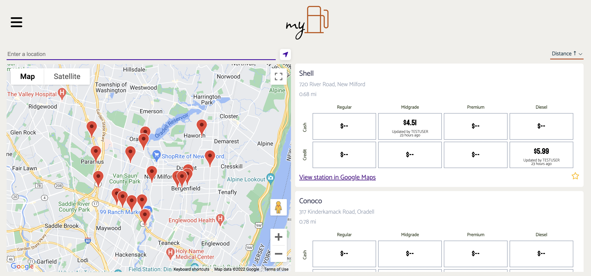
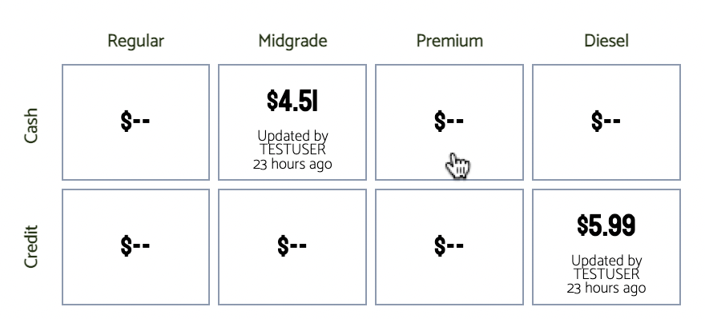
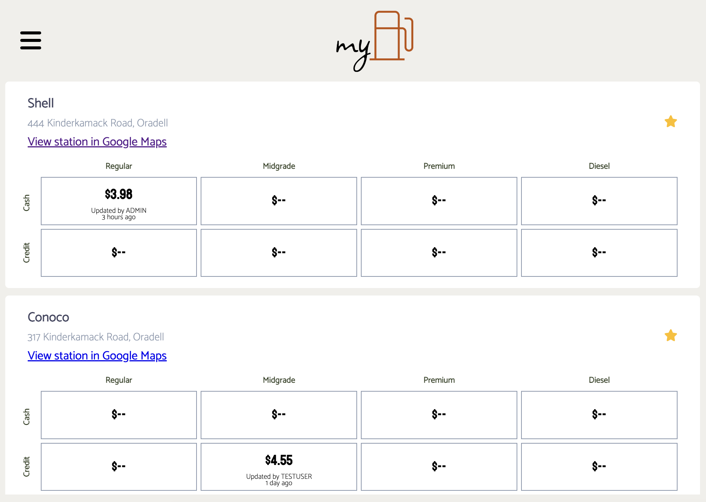
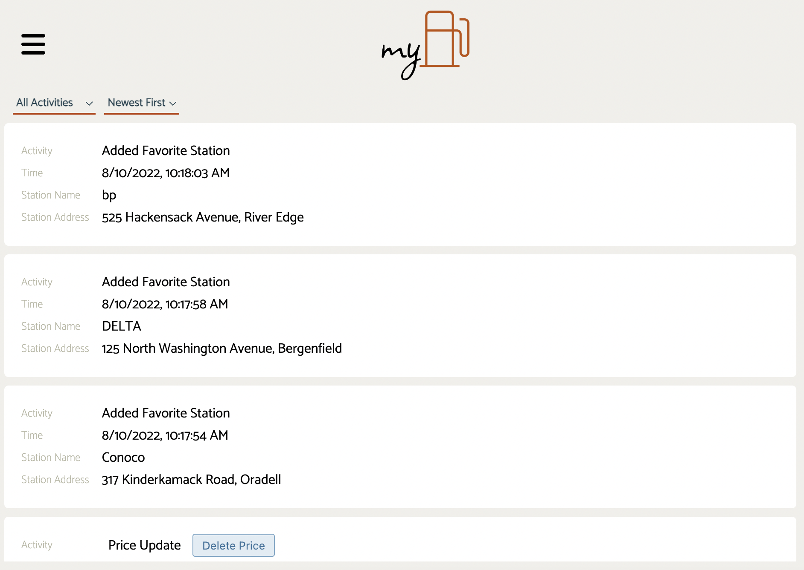
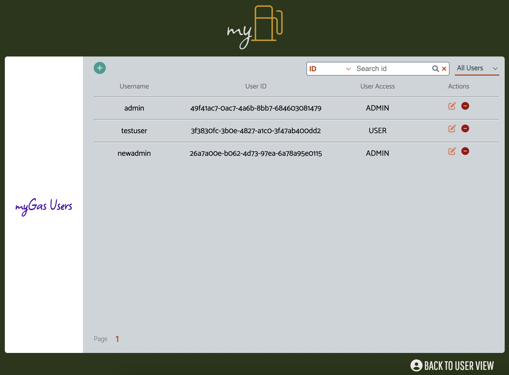

# myGas

myGas allows users to view gas stations in the area along with gas prices provided by fellow users of the app. Users help fellow users know current gas prices and contribute by submitting updated prices.

## Features

- View stations in area
- Price update
- Add to favorites
- View user activity log
- [ADMIN] Manage users

### Gas stations

Using Google Maps, view gas stations in your current location or in your location of choice. A map alongside a list of the results can be seen on the app. Add stations to your favorites list by clicking on the star.

### Update Prices

In the station's price table, update the price by clicking on the box corresponding to the type of gas and payment method. The same can also be done in your Favorites page.

### Favorites

Easily access, monitor and update prices at your favorite stations in your Favorites page.

### Activity log

View stations you've added and removed from your favorites list as well as price updates you've made. You may also undo / delete any previously submitted price updates in this page.

### [ADMIN] Manage users

Users with Admin access can view a list of all of the app's users. Only Admin can provide admin access to other users and edit emails/usernames. Admin can also delete any user's account in this page.

